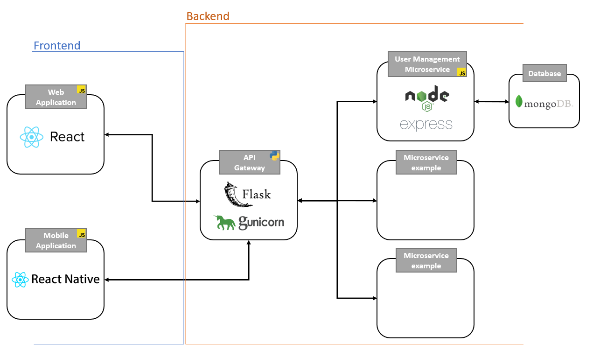

# Preview

Preview is a **Microservices** based project created for demonstration purpose.
&nbsp;

## Live Demo
The live demo of Preview project can be found at this address:
<a href="https://pawlaczyk.fr/">https://pawlaczyk.fr</a>
&nbsp;

## Project overview

### Project Features
This project is still in early development steps, it so suffers from a lack of functionalities. 
The User Management is the only microservice implemented yet.  
Like most of the microservice based project, it uses an API Gateway as clients requests single entry point.
&nbsp;

### Project General Overview Diagram

&nbsp;

### Project components
This project is composed by different components working with each others. The description of these components can be found bellow in this document.

  **Clients:**
  - [Web Application](#web-application)
  - [Mobile Application](#mobile-application)

  **Gateway:**
  - [API Gateway](#api-gateway)

  **Microservices:**
  - [User Management Microservice](#user-management-microservice)
&nbsp;

### Hosts Providers
The Preview project involve several hosting providers. The description and usage of these providers can be found bellow in this document.

  **Hosting:**
  - [OVH VPS](#ovh-vps)
  - [Heroku](#heroku)
  - [MongoDB Atlas](#mongodb-atlas)
&nbsp;

### UI / UX
In this project, the aim was to have the same user interface on both mobile and web application.
To do that, <a href="https://material-ui.com/">Material-UI</a> and <a href="https://reactnativepaper.com/">React-Native-Paper</a> are used as graphic libraries.

Like those two libraries are <a href='https://material.io/design'>Material Design</a> compliant, implement a similar interface on any device is quite easy.
&nbsp;

### Languages
Preview is a multi-languages project. **English** and **French** language can be used in both mobile and web application.

The language selection is proposed to the user the first time application is launched.

The language selection can be changed any time from applications settings.
&nbsp;

## Project components

### Web Application
Language used: **Javascript**  

The Web Application is the first client designed to working with the Preview API.

This application has been made using the <a href='https://fr.reactjs.org/'>React</a> framework and the <a href='https://material-ui.com/'>Material-UI</a> library.

Main packages: 
<a href='https://github.com/axios/axios'>Axios</a> is used as promise based HTTP client used to handle API requests. 
<a href='https://airbnb.design/lottie/'>Lottie</a> is used as graphic animations library. 
<a href='https://www.npmjs.com/package/crypto-es'>Crypto-es</a> is used to secure data stored in persistent storage.

#### Install

The live demo of Preview project can be found at this <a href="https://pawlaczyk.fr/">address</a>.
However, you can build the application to run it locally following this procedure:

<pre><code>git clone https://github.com/RomainPawlaczyk/Preview.git</code></pre>
<pre><code>cd Preview/WebApp</code></pre>
<pre><code>npm install</code></pre>

#### Usage

<pre><code>npm start</code></pre>
&nbsp;

### Mobile Application
Language used: **Javascript**  

The Mobile Application is the second client designed to working with the Preview API.

The application was designed to be fully **Cross-Platform**, so it can be run on a **Android** or **Apple** device.
However, I don't have a Mac at my disposal, so the build for Apple devices has not been tested yet.

This application has been made using the <a href='https://reactnative.dev/'>React-Native</a> framework and the <a href='https://reactnativepaper.com/'>React-Native-Paper</a> library.

Main packages: 
<a href='https://github.com/axios/axios'>Axios</a> is used as promise based HTTP client used to handle API requests. 
<a href='https://airbnb.design/lottie/'>Lottie</a> is used as graphic animations library. 
<a href='https://www.npmjs.com/package/crypto-es'>Crypto-es</a> is used to secure data stored in persistent storage.

#### Install

<pre><code>git clone https://github.com/RomainPawlaczyk/Preview.git</code></pre>
<pre><code>cd Preview/MobileApp</code></pre>
<pre><code>npm install</code></pre>

#### Usage

<pre><code>react-native run-android</code></pre>
*be sure to have a virtual or physical device launched and ready*
&nbsp;

### API Gateway
Language used: **Python** 
Version: **3.9.1** 

The API Gateway is the unique entry point of the Preview clients to communicates with the backend microservices.
It act like a reverse proxy who accepts all API calls, gathers the different services involved and returns the appropriate result.

Main packages: 
<a href='https://flask.palletsprojects.com/en/1.1.x/'>Flask</a> is used as micro HTTP server. 
<a href='https://gunicorn.org/'>Gunicorn</a> is used as wrapper to the Flask server to provide **WSGI** interface. 
<a href='https://docs.python.org/3/library/asyncio.html'>Asyncio</a> is used as asynchronous management library. 
<a href='https://requests.readthedocs.io/en/master/'>Requests</a> is used as simple HTTP requests library.
&nbsp;

### User Management Microservice
Language used: **Javascript**  
The user management microservice handle all the functionalities involving users.

it includes:
  - Account creation
  - Email verification
  - Reset password email (**OTP**)
  - Login with credentials
  - Login with session token (**JWT**)
  - Data access token (**JWT**)

To communicates with this service, a specific **REST API** has been made using <a href="https://nodejs.org/">Node.js</a> and <a href="https://expressjs.com/">Express.js</a>.

Main packages: 
<a href='https://mongoosejs.com/'>Mongoose</a> is used as MongoDB object modeling tool. 
<a href='https://www.npmjs.com/package/bcryptjs'>Bcrypt</a> is used as encryption library. 
<a href='https://nodemailer.com/'>Nodemailer</a> is used as mailer management package. 
<a href='https://www.npmjs.com/package/jsonwebtoken/'>JSON Web Token</a> is used as token library. 
<a href='https://openbase.io/js/@otplib/preset-v11/documentation'>OtpLib</a> is used as OTP management package.
&nbsp;

## Hosts Providers

### OVH VPS
A VPS is a distant server which from it's possible to do quite everything.
For this project, the VPS is used for hosting:
  - The **web server** used to expose the [React web application](#web-application) over the web. 
  *The Web Server used in this project is an <a href='https://httpd.apache.org/'>Apache</a> web server.*
  *For obvious security reasons, the web server is configured to use the **HTTPS** protocol with <a href="https://letsencrypt.org/">Let's Encrypt</a> **SSL** certificates.*

  - The [User Management Microservice](#user-management-microservice)

The VPS is an <a href='https://www.ovhcloud.com/'>OVH VPS</a>, with **Ubuntu 20.04.1** LTS used as distribution.
&nbsp;

### Heroku
<a href='https://www.heroku.com/'>Heroku</a> is a **PaaS** (platform as a service) that enables developers to build, run, and operate applications entirely in the cloud. 
For this project, Heroku has been used to host the [API Gateway](#api-gateway).
&nbsp;

### MongoDB Atlas
<a href="https://www.mongodb.com/">MongoDB</a> and more precisely, **MongoDB Atlas** has been used for this project.
MongoDB Atlas is a global cloud database service for modern applications.

MongoDB is **NoSQL** documents-oriented database working with **JSON** format.
For this project, MongoDB Atlas has been used to host the user management microservice database.
&nbsp;

